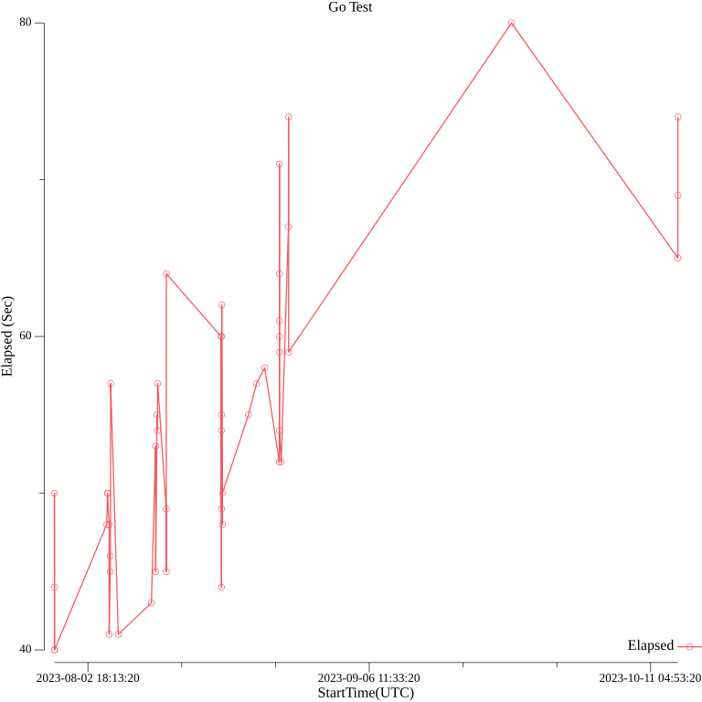

# gha-timegraph

## Overview

Graphs the execution time of GitHub Actions.



## Installation

You can install with Homebrew.

```bash
brew install koh-sh/tap/gha-timegraph
```

Or download prebuild binary from [Releases](https://github.com/koh-sh/gha-timegraph/releases)

## Usage

```bash
Graphs the execution time of GitHub Actions.

It creates GitHub Actions execution time as PNG graph.
Set GITHUB_TOKEN for private repositories.

Usage:
  gha-timegraph [flags]

Flags:
      --branch string     Branch name to filter results
      --count int         count of Workflow runs (default 30)
  -h, --help              help for gha-timegraph
      --out string        format of output 'png|csv|table|json' (default "png")
      --outfile string    name of output png file (default "graph.png")
      --owner string      Owner of the Action (Required)
      --repo string       Repository of the Action (Required)
      --silent            Hide Progress bar for GitHub API
  -t, --toggle            Help message for toggle
  -v, --version           version for gha-timegraph
      --workflow string   workflow filename of the Action (Required)
```

## QuickStart

### Create PNG graph with the command

Run this command with options would create png graph of GitHub Actions execution time.

```bash
% gha-timegraph --owner koh-sh --repo codebuild-multirunner --workflow go-test.yml
PNG save to graph.png
% ls -l graph.png
-rw-r--r--@ 1 koh  staff  43189 Nov  5 15:56 graph.png
```

### Use options to change plot counts or filter branch

```bash
      --branch string     Branch name to filter results
      --count int         count of Workflow runs (default 30)
```

### Set GITHUB_TOKEN for private repositories

Or If you hit API rate limit, set GITHUB_TOKEN and retry.

```bash
% export GITHUB_TOKEN="your Personal Access Token"
% gha-timegraph --owner koh-sh --repo [name of private repo] --workflow go-test.yml

```

### Dump data other than PNG

Currently it supports CSV, MarkDown Table, and Json output too.

```bash
% gha-timegraph --owner koh-sh --repo codebuild-multirunner --workflow go-test.yml --count 10 --out csv
Name,StartTime(UTC),Elapsed
Go Test,2023-11-03 21:48:53,65
Go Test,2023-11-03 21:48:45,48
Go Test,2023-11-03 21:47:39,103
Go Test,2023-11-03 21:46:10,51
Go Test,2023-10-27 21:35:57,59
Go Test,2023-10-20 21:40:23,88
Go Test,2023-10-14 13:51:03,74
Go Test,2023-10-14 13:47:52,61
Go Test,2023-10-14 13:47:06,69
Go Test,2023-10-14 13:44:32,82
```
